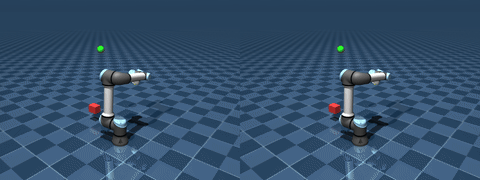
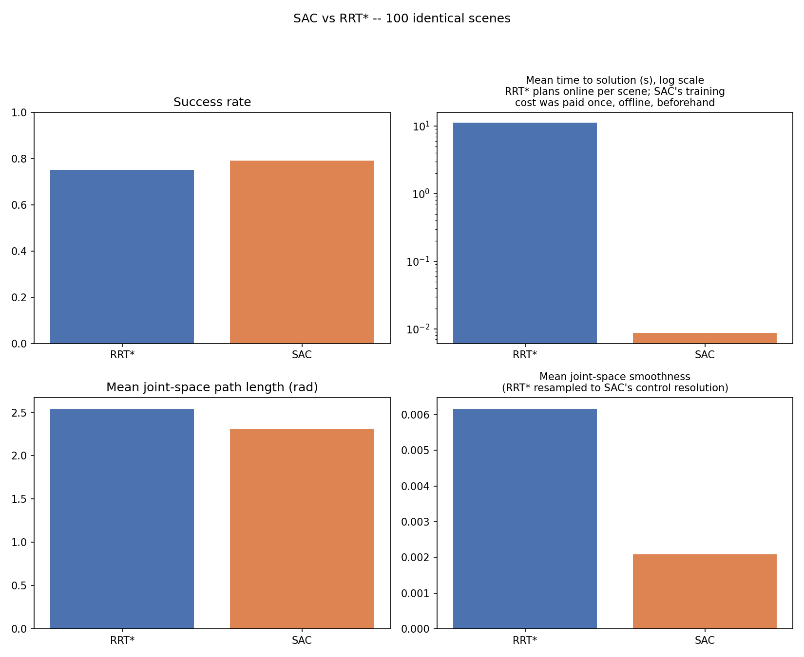
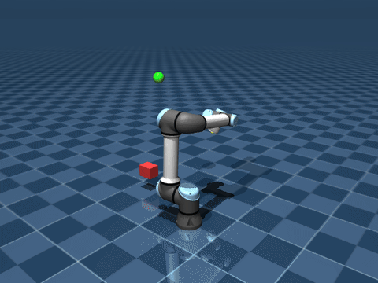
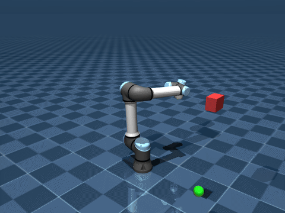
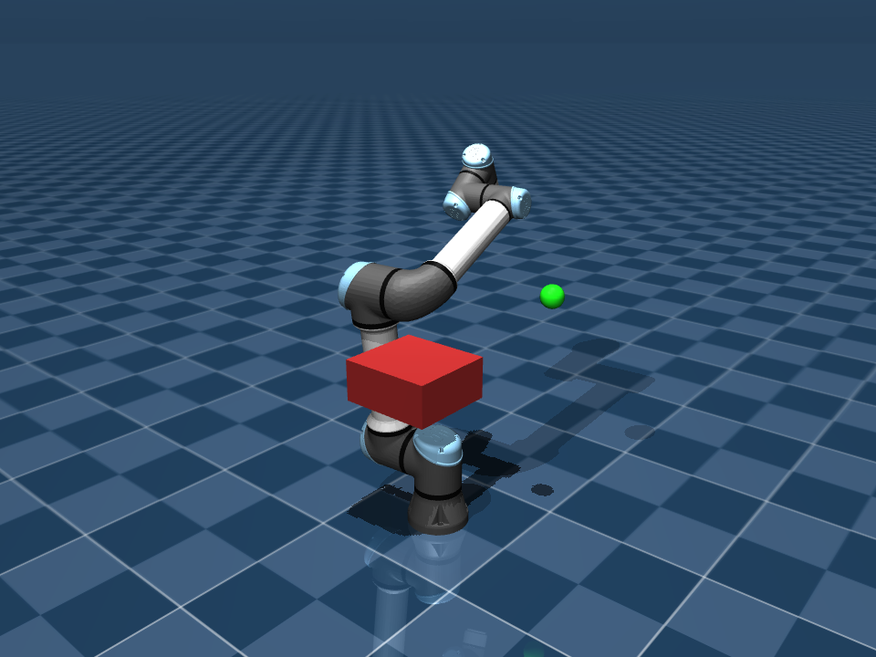
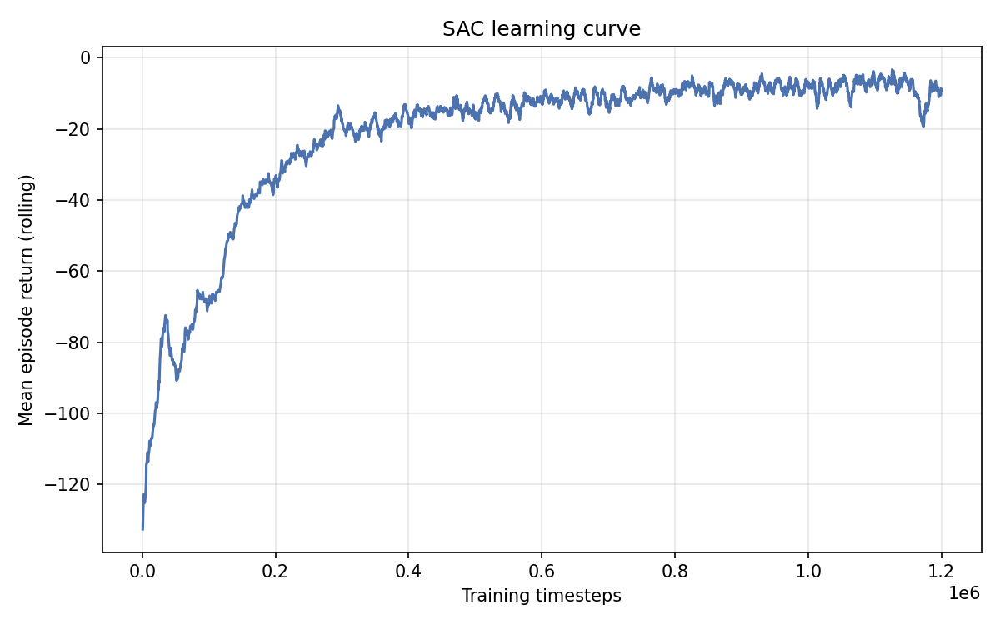

# Learning-Based Motion Planning for the UR5e

**Reinforcement learning vs. classical sampling-based planning, on the same robot.**

A Universal Robots UR5e (official DeepMind MuJoCo Menagerie model) learns to reach a target while
avoiding an obstacle using Soft Actor-Critic (SAC), then gets benchmarked against RRT*, a classical
motion planner, on 100 identical scenes. Every number below is measured, not assumed.

  
   
  <em>SAC (left) vs RRT* (right). Same start, same target, same obstacle.</em>

---

## Why this exists

Sampling-based planners like RRT* are the classical answer to robot motion planning: give them a
start, a goal, and a collision checker, and they'll find a provably valid path online, with no
training required. Reinforcement learning takes a different bet: pay an expensive training cost
once, offline, and get a policy that reacts in milliseconds afterward. For a 6-DOF arm reaching
around a single obstacle, how do these two actually compare? This project answers that question.

## Results

100 identical scenes: same seed, same start configuration, same target, same obstacle for both
methods. Full methodology and the caveats behind these numbers are in
[`docs/development_log.md`](docs/development_log.md).

  

| | RRT* | SAC |
|---|---|---|
| **Success rate** | 75% | 79% |
| **Failure mode** | 24% IK reached the target but another arm link hit the obstacle; ~1% planning timeout | 11% collision, 10% ran out of time |
| **Time to solution** | 14.8s, planned online for every scene | 0.006s, from a policy trained offline |
| **Path length** (successes) | 2.54 rad | 2.31 rad |
| **Smoothness** (successes) | 0.0062 | 0.0021 |
| **Final distance to target** (successes) | 0.019 m | 0.045 m |

Success rates land close, within 4 points, but the two methods fail differently. RRT*'s failures
are almost entirely a weak link earlier in the pipeline: the inverse-kinematics step finds an
end-effector position that reaches the target but puts another arm link through the obstacle. Once
IK hands it a valid goal, RRT* essentially never times out. SAC's failures split between real
collisions and running out of episode time.

SAC's learned policy also produces a shorter, roughly 3x smoother path on average, plausibly
because it isn't tied to whichever redundant-DOF configuration IK happened to converge to. RRT*
lands closer to the target when it succeeds, which tracks with its goal being defined by IK
convergence to that same threshold in the first place.

The time-to-solution gap, about 2,500x, is the RL-vs-planning trade-off in one number: SAC pays
its cost once, offline, during training. RRT* pays a real cost every time it's asked to plan.

<table>
<tr>
<td width="50%" align="center"> <em>SAC reaching the target, under a second of sim time.</em></td>
<td width="50%" align="center"> <em>RRT*'s planned path, executed kinematically.</em></td>
</tr>
</table>

Failures are shown too. This is a real SAC episode colliding with the obstacle, not staged:

  

## How it works

  

The task is built as a Gymnasium environment (`env/`) on top of the official MuJoCo Menagerie
UR5e model. Each episode, the robot has to reach a randomly sampled 3D target while a procedurally
placed box obstacle sits somewhere in the way. Actions are normalized joint-position increments.
The observation is padded to a fixed size for up to five obstacle slots, so a policy trained on
one obstacle could later be tested against more without changing the network architecture.

SAC (`training/`, `evaluation/`) trains from scratch on that environment with
`stable-baselines3`, no imitation learning or reward shaping beyond a plain distance + collision +
success reward. The learning curve below is the real TensorBoard log from the exact checkpoint
used in the benchmark above, not a smoothed or cherry-picked run.

  

RRT and RRT* (`planning/`) are implemented from scratch and plan directly in the robot's 6D joint
configuration space. Both call the exact same MuJoCo collision-checking function the RL
environment uses, so neither method gets an easier version of the world. RRT* adds parent
selection and rewiring for shorter paths, and its cost bookkeeping is verified to stay correct
even after a node gets rewired mid-search. A small numerical inverse-kinematics solver bridges the
gap between the environment's Cartesian target and the joint-space goal RRT* needs.

The benchmark (`scripts/benchmark.py`) runs both methods on N identical, independently
reproducible scenes and computes success rate, time-to-solution, path length, smoothness, and
failure breakdowns with the same formulas for both, so the numbers are actually comparable.

## Limitations

- **Single seed.** The RL results above come from one training seed. A rigorous comparison would
  train several seeds and report a mean and spread, not one run.
- **One obstacle.** The environment supports up to five procedurally placed obstacles and the
  observation space is already sized for it, but training and benchmarking so far only cover the
  single-obstacle case.

## Acknowledgments

Robot model: [DeepMind MuJoCo Menagerie](https://github.com/google-deepmind/mujoco_menagerie)'s
`universal_robots_ur5e`. Simulation: [MuJoCo](https://mujoco.org/). RL: [Stable-Baselines3](https://stable-baselines3.readthedocs.io/).
